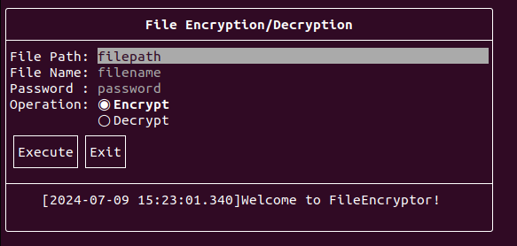
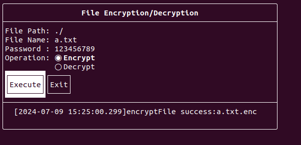
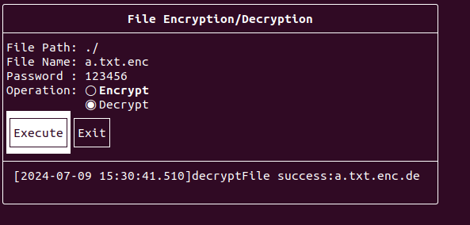

# FileEncryptor

## Introduction

This application is a file encryption and decryption tool, primarily used to encrypt and decrypt files with a password, and features a user-friendly interface in the terminal.


## How to Use

First, compile the project into an executable program, then prepare as follows:

```bash
$ ls
FileEncryptor
$ echo "hello FileEncryptor"> a.txt
$ ls
a.txt  FileEncryptor
$ cat a.txt 
hello FileEncryptor

$ ./FileEncryptor # Run the application to encrypt the file
```

The UI looks as follows:



To encrypt the file using the password 123456, follow the method shown below:



You will find a new file `a.txt.enc` in the current directory, which is the file encrypted with the password.

Next, decrypt the `a.txt.enc` file using the same password, 123456:



Finally, check the file:

```bash
$ ls
a.txt  a.txt.enc  a.txt.enc.dec  FileEncryptor
$ cat a.txt.enc.dec 
hello FileEncryptor
$ 
```

